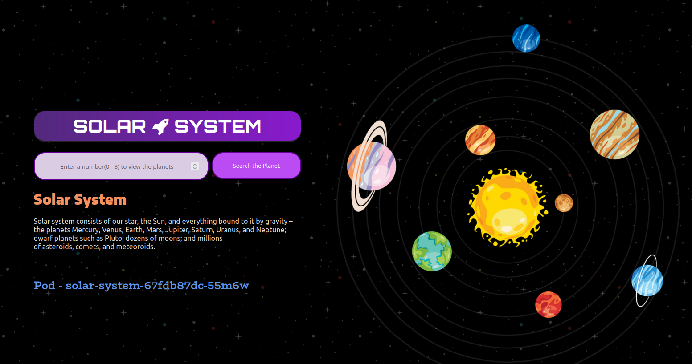
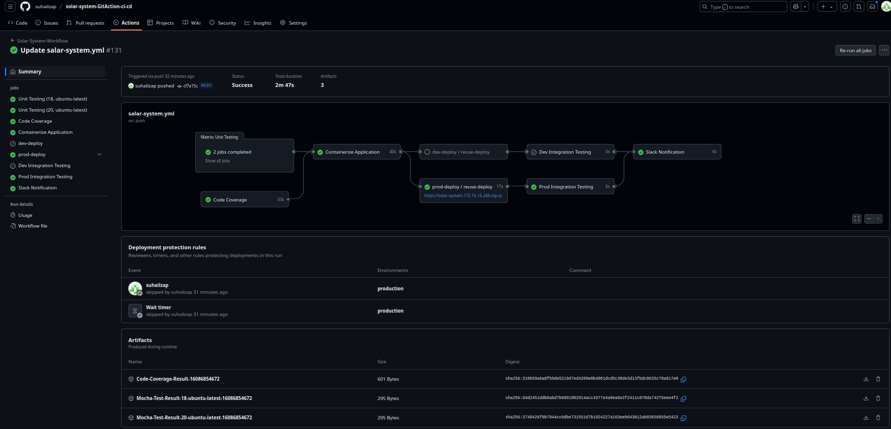
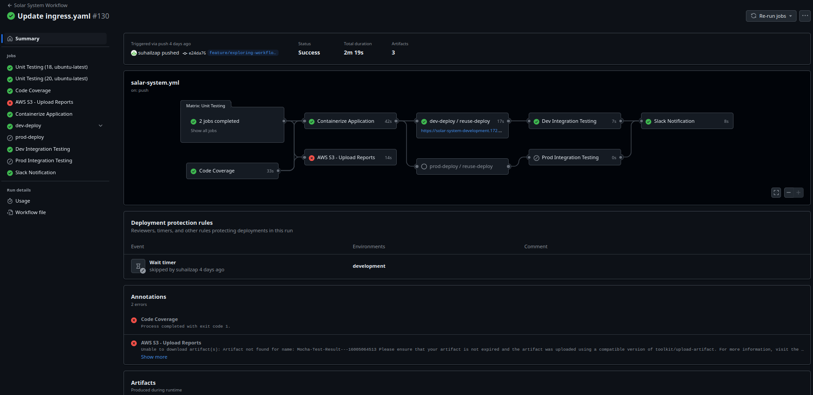
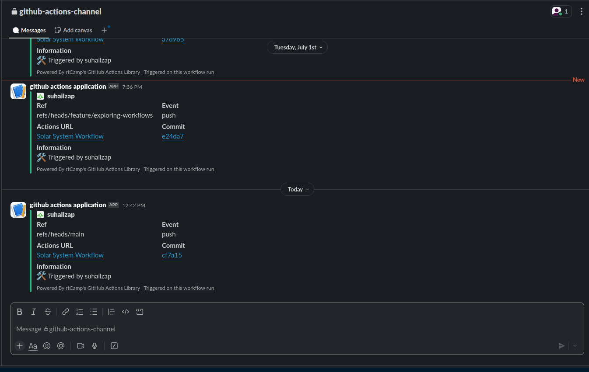

# 🚀 Full-Stack CI/CD Pipeline for Kubernetes 🚀

[](https://github.com/suhailzap/solar-system-GitAction-ci-cd/actions)
[](https://opensource.org/licenses/MIT)


This repository demonstrates a production-grade, end-to-end CI/CD pipeline for a Node.js application. The pipeline automates everything from testing and containerization to multi-environment deployment on a **Kubernetes** cluster, complete with real-time **Slack notifications**.

The sample application is a beautiful **Solar System UI** built with pure HTML/CSS.

---

## ✨ Project Showcase

### 🪐 The Solar System UI

A responsive and visually stunning solar system animation.

> **➡️ View Live Demo ⬅️**




### 🤖 The Automated CI/CD Pipeline

A dynamic, multi-stage workflow graph showing the entire process from code to deployment.







### 🔔 Real-Time Slack Notifications

Get instant feedback on your deployment status directly in your Slack workspace.




---

## 🌟 Core Features

-   ✅ **Multi-Stage Testing:** Parallel unit testing and code coverage analysis.
-   🐳 **Automated Containerization:** Builds and pushes a versioned Docker image to multiple registries (Docker Hub & GHCR).
-   🚀 **Multi-Environment Deployment:** Deploys to `development` (from `feature/*` branches) and `production` (from `main` branch).
-   🏗️ **Infrastructure as Code:** Uses parameterized Kubernetes manifests for consistent deployments.
-   ♻️ **Reusable Workflows:** A modular, reusable deployment workflow keeps the pipeline DRY (Don't Repeat Yourself).
-   🔔 **Rich Notifications:** Instant success or failure notifications in Slack.
-   🔐 **Secure by Design:** Uses GitHub Secrets and Environments for managing sensitive data and deployment rules.

---

## 🛠️ Technology Stack

| Category | Technology | Purpose |
| :--- | :--- | :--- |
| **Application** | **Node.js** | Backend Runtime Environment |
| | **HTML5 / CSS3** | Frontend for the Solar System UI |
| **Testing** | **Mocha** | JavaScript Test Framework |
| | **Istanbul (nyc)** | Code Coverage Reporting |
| **DevOps** | **GitHub Actions**| CI/CD Orchestration |
| | **Docker** | Application Containerization |
| **Infrastructure** | **Kubernetes (K8s)** | Container Orchestration & Hosting |
| | **Traefik** | Ingress Controller for routing traffic |
| **Notifications** | **Slack** | Real-time pipeline status updates |

---

## 🗺️ The CI/CD Pipeline: An In-Depth Look

This pipeline is the heart of the project. It's a series of automated jobs that ensure code is tested, packaged, and deployed reliably.

**The Flow:** `Code Push` ➡️ `Test & Analyze` ➡️ `Build & Push` ➡️ `Deploy` ➡️ `Integrate & Notify`

### 1. 🧪 Test & Analyze
-   **`unit-testing`**: Runs unit tests in parallel across multiple Node.js versions (18, 20) using a **Matrix Strategy**. A temporary MongoDB service container is spun up for isolated testing.
-   **`code-coverage`**: Calculates the percentage of code covered by tests, ensuring code quality. Results are archived for review.

### 2. 🐳 Build & Containerize
-   **`docker`**: This job only runs if all tests pass.
    -   Logs into Docker Hub and GitHub Container Registry (GHCR).
    -   Builds a Docker image tagged with the unique Git commit SHA for traceability.
    -   Performs a "smoke test" by running the container locally to ensure it's not broken.
    -   Pushes the verified image to both container registries.

### 3. 🚀 Deploy to Kubernetes
-   **`dev-deploy` / `prod-deploy`**: These jobs are triggered based on the branch.
    -   **`feature/*` branches ➡️ `development` environment.**
    -   **`main` branch ➡️ `production` environment.**
    -   They call the powerful **`reuse-deployment.yml`** workflow, passing in environment-specific parameters (like the Kubernetes manifest path).

### 4. 🔄 Integration Testing & Notifications
-   **`dev/prod-integration-testing`**: After deployment, this job runs a `curl` command against the live application URL (provided as an output from the deployment job) to verify the service is up and running.
-   **`slack-notification`**: At the end of the pipeline, a message is sent to a Slack channel with the build status, commit details, and a link to the workflow run.

### ♻️ The Reusable Deployment Workflow (`reuse-deployment.yml`)
This is a generic "deployment machine" that can be called by any workflow.
-   It accepts parameters (`inputs`) like the environment name and manifest directory.
-   It securely uses secrets (`KUBE_CONFIG`, `MONGO_PASSWORD`).
-   It populates Kubernetes manifest templates with dynamic values (like the Docker image tag).
-   It applies the final configuration to the target Kubernetes cluster on a **self-hosted runner**.

---

## ⚙️ Getting Started Locally

To run the application on your local machine:

1.  **Clone the repository:**
    ```sh
    git clone https://github.com/suhailzap/solar-system-GitAction-ci-cd.git
    cd solar-system-GitAction-ci-cd
    ```

2.  **Install dependencies:**
    ```sh
    npm install
    ```

3.  **Run the application:**
    (You may need to set environment variables like `MONGO_URI` locally)
    ```sh
    npm start
    ```

4.  **Run tests locally:**
    ```sh
    npm test
    ```

---

## 🔑 Repository Configuration

To fork and run this pipeline yourself, you must configure the following in your repository settings under `Settings > Secrets and variables > Actions`:

### Secrets
| Secret Name | Description | Example |
| :--- | :--- | :--- |
| `DOCKERHUB_PASSWORD` | Your access token for Docker Hub. | `dckr_pat_...` |
| `KUBE_CONFIG` | Base64 encoded content of your `kubeconfig` file. | `cat ~/.kube/config \| base64` |
| `MONGO_PASSWORD` | The password for your MongoDB user. | `your-secure-password` |
| `SLACK_WEBHOOK_URL`| The incoming webhook URL from your Slack app. | `https://hooks.slack.com/services/...` |

### Variables
| Variable Name | Description | Example |
| :--- | :--- | :--- |
| `DOCKERHUB_USERNAME`| Your Docker Hub username. | `suhailzap` |
| `MONGO_URI` | The connection string for your MongoDB Atlas cluster. | `mongodb+srv://...` |
| `MONGO_USERNAME` | The username for your MongoDB database. | `my-app-user` |
| `NAMESPACE` | The default Kubernetes namespace for deployments. | `solar-system` |

---


## 👤 Author

**Suhail K** - [GitHub @suhailzap](https://github.com/suhailzap)


[](https://github.com/suhailzap/solar-system/actions/workflows/salar-system.yml)

# Solar System NodeJS Application

A simple HTML+MongoDB+NodeJS project to display Solar System and it's planets.

---
## Requirements

For development, you will only need Node.js and NPM installed in your environement.

### Node
- #### Node installation on Windows

  Just go on [official Node.js website](https://nodejs.org/) and download the installer.
Also, be sure to have `git` available in your PATH, `npm` might need it (You can find git [here](https://git-scm.com/)).

- #### Node installation on Ubuntu

  You can install nodejs and npm easily with apt install, just run the following commands.

      $ sudo apt install nodejs
      $ sudo apt install npm

- #### Other Operating Systems
  You can find more information about the installation on the [official Node.js website](https://nodejs.org/) and the [official NPM website](https://npmjs.org/).

If the installation was successful, you should be able to run the following command.

    $ node --version
    v8.11.3

    $ npm --version
    6.1.0

---
## Install Dependencies from `package.json`
    $ npm install

## Run Unit Testing
    $ npm test

## Run Code Coverage
    $ npm run coverage

## Run Application
    $ npm start

## Access Application on Browser
    http://localhost:3000/
## Understanding The Deployment


